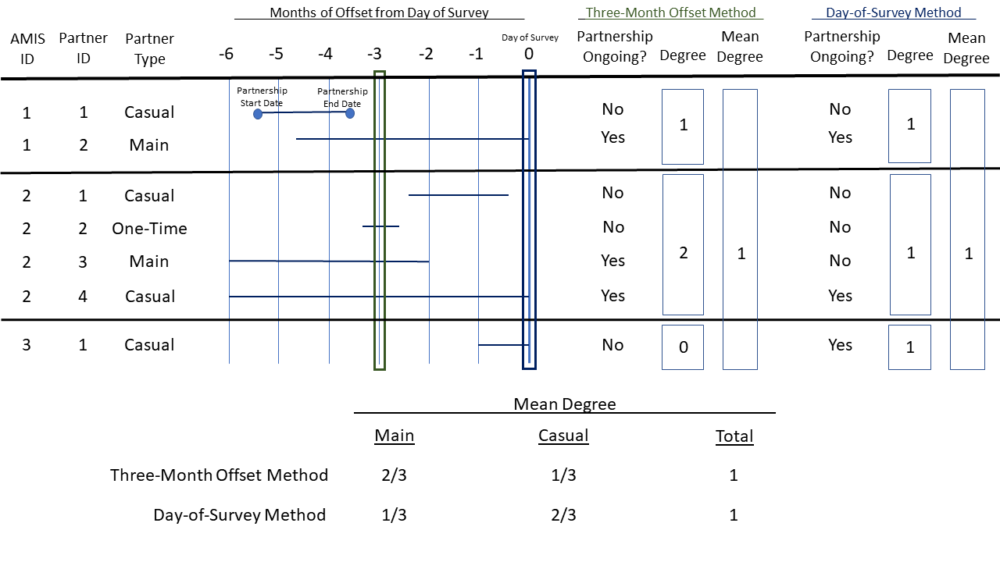

```{r setup, include=FALSE}
knitr::opts_chunk$set(echo = TRUE)
```

## Purpose

To compare two methods of determining the mean degree of ongoing casual and main partnerships using response data from the ART-net study.

## Description

Mean degree is an important measure of network connectivity which represents the average number of edges connected to a node/vertex. In this context, mean degree represents the average number of concurrent ongoing partners of an individual enrolled in the ART-net study.
The American Men's Internet Survey (AMIS), from which the ART-net study sources data, explicitly asks individuals about ongoing partnerships. Mean degree can be calculated through analysis of the responses to this question as a result. A similar question does not appear on the RADAR survey. As a result, alternate methods may be employed to estimate active and ongoing partnerships to derive the mean degree of individuals in the partnership network.
 
## Methods and Results

The ART-Net Survey asks study participants about the number of partners they have had in the past 12 months:

> In the past 12 months (since the same month last year), with how many different 
> men have you had either oral or anal sex?

The survey follows up with a question asking about the number of active, ongoing
sexual partnerships at the time of the survey among all partnerships that have occurred in the past 12 months:

> Next, think of all the men who you are in an active, ongoing sexual relationship 
> with. By that, we mean that you generally have oral or anal sex at least once per 
> month and you expect to continue doing so for some time. How many of your 
> partnerships in the past twelve months are active and ongoing?

As discussed in the description, mean degree can then be directly calculated from the responses to the above questions. 
I will refer to this as the **day-of-survey method**.

\newpage
Below is the code to calculate mean degree by partnership type - casual or main - using the day of survey method from the ART-net long and wide datasets. Note that the granularity of the ART-net long dataset is the individual partnerships whereas the granularity of the ART-net wide dataset is the surveyed individual. First, the number of ongoing partnerships per individual is assessed using the long dataset. Then, mean degree is calculated by summing ongoing partnerships by surveyed individual and dividing by total surveyed individuals using the wide dataset.

```{r load, include=FALSE}
library(ARTnetData)
library(dplyr)
library(knitr)
options(kableExtra.latex.load_packages = FALSE)
library(kableExtra)
setwd("~/EpiModel Lab/ARTnet RADAR Mean Degree Comparison/ARTnet-RADAR/Analysis/Mean Degree Method Comparison")
```

```{r dos, warning=FALSE}
ARTnet.long$ONGOING <- as.numeric(ARTnet.long$ONGOING)
ARTnet.long$ongoing2 <- ifelse(is.na(ARTnet.long$ONGOING), 0, ARTnet.long$ONGOING)

ARTnet.wide <- ARTnet.long %>%
  filter(RAI == 1 | IAI == 1 | ROI == 1 | IOI == 1) %>%
  filter(ptype == 1) %>%
  group_by(AMIS_ID) %>%
  summarise(deg.main.dos = sum(ongoing2)) %>%
  right_join(ARTnet.wide, by = "AMIS_ID")

ARTnet.wide <- ARTnet.long %>%
  filter(RAI == 1 | IAI == 1 | ROI == 1 | IOI == 1) %>%
  filter(ptype == 2) %>%
  group_by(AMIS_ID) %>%
  summarise(deg.casl.dos = sum(ongoing2)) %>%
  right_join(ARTnet.wide, by = "AMIS_ID")

ARTnet.wide$deg.main.dos <- ifelse(is.na(ARTnet.wide$deg.main.dos), 
                                   0, ARTnet.wide$deg.main.dos)
ARTnet.wide$deg.casl.dos <- ifelse(is.na(ARTnet.wide$deg.casl.dos), 
                                   0, ARTnet.wide$deg.casl.dos)

mean.deg.main.dos <- mean(ARTnet.wide$deg.main.dos)
mean.deg.casl.dos <- mean(ARTnet.wide$deg.casl.dos)
```

```{r dos_results, echo=FALSE}
cat("Using the day-of-survey method, the mean degree of main partnerships\n among individuals in the ART-net dataset is: ", round(mean.deg.main.dos,4))

cat("Using the day-of-survey method, the mean degree of casual partnerships\n among individuals in the ART-net dataset is: ", round(mean.deg.casl.dos,4))
```

\newpage
In contrast, an alternate approach referred to as the **three-month offset method**, for deriving active and ongoing partnerships may also be used in the instance where individuals are not explicitly asked about number of active and ongoing partners at the time of the survey. 

The three-month offset method starts by taking a three-month offset of the survey date. For example, if an individual was surveyed July 15th 2019, then their three-month offset would be April 15th 2019. Once this offset is established for all surveyed individuals, each individual partership is assessed to determine if the three-month offset falls between the start and end date of the partnership. If the three-month offset falls between the partership start and end date, then the partnership is considered active and ongoing; otherwise, it is not considered active and ongoing.


\newpage
Similar code to the block above calculating mean degree using the day-of-survey method is used to calculate mean degree assessing ongoing partnerships using this three-month offset method.

```{r three_month, warning=FALSE}
prior.month.of.evaluation <- 3
ARTnet.long$ongoing.evaluation.date <- ARTnet.long$SUB_DATE - 
  round(prior.month.of.evaluation*30.44)
ARTnet.long$ongoing3 <- ifelse(ARTnet.long$start.date <
                                 ARTnet.long$ongoing.evaluation.date &
                                 ARTnet.long$end.date >=
                                 ARTnet.long$ongoing.evaluation.date, 1, 0)

ARTnet.wide <- ARTnet.long %>%
  filter(RAI == 1 | IAI == 1 | ROI == 1 | IOI == 1)) %>%
  filter(ptype == 1) %>%
  group_by(AMIS_ID) %>%
  summarise(deg.main.three.month = sum(ongoing3)) %>%
  right_join(ARTnet.wide, by = "AMIS_ID")

ARTnet.wide <- ARTnet.long %>%
  filter(RAI == 1 | IAI == 1 | ROI == 1 | IOI == 1)) %>%
  filter(ptype == 2) %>%
  group_by(AMIS_ID) %>%
  summarise(deg.casl.three.month = sum(ongoing3)) %>%
  right_join(ARTnet.wide, by = "AMIS_ID")

ARTnet.wide$deg.main.three.month <- ifelse(is.na(ARTnet.wide$deg.main.three.month), 
                                           0, ARTnet.wide$deg.main.three.month)
ARTnet.wide$deg.casl.three.month <- ifelse(is.na(ARTnet.wide$deg.casl.three.month), 
                                           0, ARTnet.wide$deg.casl.three.month)

mean.deg.main.three.month <- mean(ARTnet.wide$deg.main.three.month)
mean.deg.casl.three.month <- mean(ARTnet.wide$deg.casl.three.month)
```

```{r three_month_results, echo=FALSE}
cat("Using the three-month offset method, the mean degree of main partnerships among\n individuals in the ART-net dataset is: ", round(mean.deg.main.three.month,4))

cat("Using the three-month offset method, the mean degree of casual partnerships among\n individuals in the ART-net dataset is: ", round(mean.deg.casl.three.month,4))
```

\newpage
Here are the results comparing mean degree by partnership type (main or casual) and method of determining ongoing partnerships (day-of-survey or three-month offset) in table form:

```{r comparison, warning=FALSE, include=FALSE}

Partnership.Type <- rbind(c("Main"),c("Casual"))

mean.degree.main <- ARTnet.wide %>%
  summarize(mean.deg.main.dos = round(mean(ARTnet.wide$deg.main.dos),4),
            mean.deg.main.three.month = round(mean(ARTnet.wide$deg.main.three.month),4))
colnames(mean.degree.main) <- c("Day-of-Survey", "Three-Month")

mean.degree.casl <- ARTnet.wide %>%
  summarize(mean.deg.casl.dos = round(mean(ARTnet.wide$deg.casl.dos),4),
            mean.deg.casl.three.month = round(mean(ARTnet.wide$deg.casl.three.month),4))
colnames(mean.degree.casl) <- c("Day-of-Survey", "Three-Month")

mean.degree.df <- data.frame(matrix(ncol = 2, nrow = 0))
colnames(mean.degree.df) <- c("Day-of-Survey", "Three-Month")

mean.degree.df <- rbind(mean.degree.df, mean.degree.main, mean.degree.casl)

mean.degree.df

```

```{r comparison_final, warning=FALSE, echo=FALSE}
mean.degree.df.final <- data.frame(matrix(ncol = 3, nrow = 0))
colnames(mean.degree.df.final) <- c("Type","Day-of-Survey","Three.Month")

mean.degree.df.final <- cbind(Partnership.Type, mean.degree.df)

kable(mean.degree.df.final) %>%
  kable_styling(bootstrap_options = "striped", font_size = 12)

```

The mean degree by partnership type calculated using the day-of-survey and three-month offset methods are similar.

Next, instead of assessing ongoing partnerships using a three-month offset, we can generalize our approach to look at n-month offsets for user specified values of n.

For the purpose of this example, we assessed ongoing partnerships with one- to twelve- month offsets and reviewed how mean degree would change depending on months of offset.

The pairs of plots below show how mean degree changes depending on number of months of offset used for determination of whether or not a partnership is ongoing. The plots show the same data, with the second pair of plots showing the results at larger scale.

The data may also be viewed in the table below the pair of plots.

\newpage
```{r generalized_month_offset, include=FALSE}
##N-Month Offset Method

# Specify start and end months for offsets
# Note: Only single month steps are supported
start_month_offset <- 0
end_month_offset <- 12

month <- seq(start_month_offset, end_month_offset)
n_month <- paste(month, "M", sep="")

# Initalize data frames with appropriate row and column dimensions
ongoing.eval.m <- matrix(nrow = length(ARTnet.long$SUB_DATE), ncol = end_month_offset - start_month_offset + 1)
ongoing.eval.df <- data.frame(ongoing.eval.m)

ongoing3.m <- matrix(nrow = length(ARTnet.long$SUB_DATE), ncol = end_month_offset - start_month_offset + 1)
ongoing3.df <- data.frame(ongoing3.m)

ARTnet.long.adjusted <- ARTnet.long
ARTnet.wide.adjusted <- ARTnet.wide

mean.degree.main <- c()
mean.degree.casual <- c()

for (i in start_month_offset:end_month_offset) {

  ongoing.eval <- paste("ongoing.evaluation.date.m",i,sep="")
  names(ongoing.eval.df)[i - start_month_offset + 1] <- ongoing.eval
  assign(ongoing.eval, ARTnet.long$SUB_DATE - round(i*30.44))
  ongoing.eval.df[,i - start_month_offset + 1] <- get(ongoing.eval)

  ongoing3 <- paste("ongoing3.m",i,sep="")
  names(ongoing3.df)[i - start_month_offset + 1] <- ongoing3
  assign(ongoing3, ifelse(ARTnet.long.adjusted$start.date < get(ongoing.eval) &
                            ARTnet.long.adjusted$end.date >= get(ongoing.eval),
                          1, 0))
  ongoing3.df[,i - start_month_offset + 1] <- get(ongoing3)

  ARTnet.long.adjusted <- cbind(ARTnet.long.adjusted,
                                ongoing.eval.df[i - start_month_offset + 1],
                                ongoing3.df[i - start_month_offset + 1])

  ARTnet.wide.adjusted <- ARTnet.long.adjusted %>%
    filter(RAI == 1 | IAI == 1 | ROI == 1 | IOI == 1)) %>%
    filter(ptype == 1) %>%
    group_by(AMIS_ID) %>%
    summarise(deg.main.n.month = sum(get(paste("ongoing3.m",i,sep="")))) %>%
    right_join(ARTnet.wide.adjusted, by = "AMIS_ID")

  #Additional filtering
  ARTnet.wide.adjusted <- ARTnet.wide.adjusted %>%
    filter(age >= 16 & age <= 29) %>%
    filter(city2 == "Chicago")
  
  ARTnet.wide.adjusted$deg.main.n.month <- ifelse(is.na(ARTnet.wide.adjusted$deg.main.n.month), 0, ARTnet.wide.adjusted$deg.main.n.month)
  mean.degree.main[i - start_month_offset + 1] <- mean(ARTnet.wide.adjusted$deg.main.n.month)
  deg.main.n.month.name <- paste("deg.main.n.month.m",i,sep="")
  names(ARTnet.wide.adjusted)[names(ARTnet.wide.adjusted) == "deg.main.n.month"] <- deg.main.n.month.name

  ARTnet.wide.adjusted <- ARTnet.long.adjusted %>%
    filter(RAI == 1 | IAI == 1 | ROI == 1 | IOI == 1)) %>%
    filter(ptype == 2) %>%
    group_by(AMIS_ID) %>%
    summarise(deg.casl.n.month = sum(get(paste("ongoing3.m",i,sep="")))) %>%
    right_join(ARTnet.wide.adjusted, by = "AMIS_ID")

  ARTnet.wide.adjusted$deg.casl.n.month <- ifelse(is.na(ARTnet.wide.adjusted$deg.casl.n.month), 0, ARTnet.wide.adjusted$deg.casl.n.month)
  mean.degree.casual[i - start_month_offset + 1] <- mean(ARTnet.wide.adjusted$deg.casl.n.month)
  deg.casl.n.month.name <- paste("deg.casl.n.month.m",i,sep="")
  names(ARTnet.wide.adjusted)[names(ARTnet.wide.adjusted) == "deg.casl.n.month"] <- deg.casl.n.month.name

}
```

```{r plots_tables, fig.align='center', fig.height=8, echo=FALSE}
# RESULTS

par(mfrow=c(2,2))

plot(month, mean.degree.main, 
     main = "\n\n\nMain Partnerships",
     xlab = "Number of Offset Months",
     ylab = "Mean Degree",
     ylim = c(0,1),
     cex.main = 0.8)
abline(h=mean.deg.main.dos, col="blue")
text(0.45*(end_month_offset - start_month_offset),
     1.12*mean.deg.main.dos,
     paste("Mean Degree:\nDay-of-Survey Method = ",round(mean.deg.main.dos,4),sep=""),
     cex = 0.5,
     adj = 0)

plot(month, mean.degree.casual, 
     main = "\n\n\nCasual Partnerships", 
     xlab = "Number of Offset Months",
     ylab = "Mean Degree",
     ylim = c(0,1),
     cex.main = 0.8)
lines(mean.deg.casl.dos)
abline(h=mean.deg.casl.dos, col="purple")
text(0.45*(end_month_offset - start_month_offset),
     1.1*mean.deg.casl.dos,
     paste("Mean Degree:\nDay-of-Survey Method = ",round(mean.deg.casl.dos,4),sep=""),
     cex = 0.5,
     adj = 0)
mtext("Partnership Mean Degree", side = 3, line = -1, outer = TRUE, font = 2)
mtext("N-Month Offset Method - Points, Day-of-Survey Method - Line", side = 3, line = -2, outer = TRUE, font = 2, cex = 0.75)

plot(month, mean.degree.main, 
     main = "Main Partnerships - Scaled",
     xlab = "Number of Offset Months",
     ylab = "Mean Degree",
     cex.main = 0.8)
abline(h=mean.deg.main.dos, col="blue")
text(0.3*(end_month_offset - start_month_offset),
     0.99*mean.deg.main.dos,
     paste("Mean Degree:\nDay-of-Survey Method = ",round(mean.deg.main.dos,4),sep=""),
     cex = .5,
     adj = 0)

plot(month, mean.degree.casual, 
     main = "Casual Partnerships - Scaled",
     xlab = "Number of Offset Months",
     ylab = "Mean Degree",
     cex.main = 0.8)
lines(mean.deg.casl.dos)
abline(h=mean.deg.casl.dos, col="purple")
text(0.45*(end_month_offset - start_month_offset),
     1.01*mean.deg.casl.dos,
     paste("Mean Degree:\nDay-of-Survey Method = ",round(mean.deg.casl.dos,4),sep=""),
     cex = .5,
     adj = 0)

par(xpd = TRUE)
text(par("usr")[2] - 18,y=mean(par("usr")[3:4]) + 0,"test taxis label",srt=-270)

#Mean degree - main
mean.degree.main.df <- data.frame(n_month, round(mean.degree.main,4))

#Mean degree - casual
mean.degree.casual.df <- data.frame(n_month, round(mean.degree.casual,4))

mean.degree.table <- mean.degree.main.df %>%
  left_join(mean.degree.casual.df, by = "n_month")
colnames(mean.degree.table) <- c("Month", "Main", "Casual")

mean.degree.table <- setNames(data.frame(t(mean.degree.table[,-1])), mean.degree.table[,1])

dos_ref_col <- rbind(c(round(mean.deg.main.dos,4)),c(round(mean.deg.casl.dos,4)))
colnames(dos_ref_col) <- c("Day-of-Survey")

mean.degree.table <- cbind(dos_ref_col, mean.degree.table)

kable(mean.degree.table) %>%
  kable_styling(bootstrap_options = "striped", font_size = 6)

```


HELPER FUNCTION FOR MEAN DEGREE BY MONTH BY CATEGORICAL VARIABLE:

```{r generalized_month_offset, include=FALSE}
##N-Month Offset Method
# Note: Only single month steps are supported

rm(list = ls())

n_month_offset <- function(start_month, end_month, filter_var='all', 
                           output_type='df') {
  
  #Install Libraries
  library(ARTnetData)
  library(tidyverse)
  
  #Create Dummy Variable 'All' to Filter for all records
  ARTnet.wide$all <- rep(1,nrow(ARTnet.wide))
  
  #Create Variable 'Age.Cat' to Create Age Categories for Ages
  ARTnet.wide$age.cat <- 
       ifelse(ARTnet.wide$age >= 15 & ARTnet.wide$age <= 24, '15-24',
       ifelse(ARTnet.wide$age >= 25 & ARTnet.wide$age <= 34, '25-34',
       ifelse(ARTnet.wide$age >= 35 & ARTnet.wide$age <= 44, '35-44',
       ifelse(ARTnet.wide$age >= 45 & ARTnet.wide$age <= 54, '45-54',
       ifelse(ARTnet.wide$age >= 55 & ARTnet.wide$age <= 65, '55-65',
       ifelse(ARTnet.wide$age >= 66, '66+', 'unknown'))))))

  #Initialize matrices for storing by-month mean degree calculations
    #Total
    mean.degree.total <- matrix(nrow = nrow(unique(ARTnet.wide[filter_var]))
                             , ncol = end_month - start_month + 1)
    mean.degree.total.dos <- matrix(nrow = nrow(unique(ARTnet.wide[filter_var]))
                             , ncol = end_month - start_month + 1)
    #Main
    mean.degree.main <- matrix(nrow = nrow(unique(ARTnet.wide[filter_var]))
                             , ncol = end_month - start_month + 1)
    mean.degree.main.dos <- matrix(nrow = nrow(unique(ARTnet.wide[filter_var]))
                             , ncol = end_month - start_month + 1)
    #Casual
    mean.degree.casual <- matrix(nrow = nrow(unique(ARTnet.wide[filter_var]))
                             , ncol = end_month - start_month + 1)
    mean.degree.casual.dos <- matrix(nrow = nrow(unique(ARTnet.wide[filter_var]))
                             , ncol = end_month - start_month + 1)
    #N
    n.main <- matrix(nrow = nrow(unique(ARTnet.wide[filter_var]))
                             , ncol = end_month - start_month + 1)
    n.casual <- matrix(nrow = nrow(unique(ARTnet.wide[filter_var]))
                             , ncol = end_month - start_month + 1)
    n.total <- matrix(nrow = nrow(unique(ARTnet.wide[filter_var]))
                             , ncol = end_month - start_month + 1)

  start_month_offset <- start_month
  end_month_offset <- end_month
  
  month <- seq(start_month_offset, end_month_offset)
  n_month <- paste(month, "M", sep="")
  
  unique_filter_var <- pull(unique(ARTnet.wide[filter_var]))
  
  for (j in 1:nrow(unique(ARTnet.wide[filter_var]))) {
  
    # Initalize data frames with appropriate row and column dimensions
    ongoing.eval.m <- matrix(nrow = length(ARTnet.long$SUB_DATE), 
                             ncol = end_month_offset - start_month_offset + 1)
    ongoing.eval.df <- data.frame(ongoing.eval.m)
    
    ongoing3.m <- matrix(nrow = length(ARTnet.long$SUB_DATE), 
                         ncol = end_month_offset - start_month_offset + 1)
    ongoing3.df <- data.frame(ongoing3.m)
    
    ARTnet.long$ONGOING <- as.numeric(ARTnet.long$ONGOING)
    ARTnet.long$ongoing2 <- ifelse(is.na(ARTnet.long$ONGOING), 0, ARTnet.long$ONGOING)
    
    ARTnet.long.adjusted <- ARTnet.long
    ARTnet.wide.adjusted <- ARTnet.wide
    
    for (i in start_month_offset:end_month_offset) {
    
      ongoing.eval <- paste("ongoing.evaluation.date.m",i,sep="")
      names(ongoing.eval.df)[i - start_month_offset + 1] <- ongoing.eval
      assign(ongoing.eval, ARTnet.long$SUB_DATE - round(i*30.44))
      ongoing.eval.df[,i - start_month_offset + 1] <- get(ongoing.eval)
    
      ongoing3 <- paste("ongoing3.m",i,sep="")
      names(ongoing3.df)[i - start_month_offset + 1] <- ongoing3
      assign(ongoing3, ifelse(ARTnet.long.adjusted$start.date < get(ongoing.eval) &
                                ARTnet.long.adjusted$end.date >= get(ongoing.eval),
                              1, 0))
      ongoing3.df[,i - start_month_offset + 1] <- get(ongoing3)
    
      ARTnet.long.adjusted <- cbind(ARTnet.long.adjusted,
                                    ongoing.eval.df[i - start_month_offset + 1],
                                    ongoing3.df[i - start_month_offset + 1])
    
      # Total Partnerships
        ARTnet.wide.adjusted <- ARTnet.long.adjusted %>%
          filter(RAI == 1 | IAI == 1 | ROI == 1 | IOI == 1) %>%
          filter(ptype %in% c(1,2)) %>%
          group_by(AMIS_ID) %>%
          summarise(deg.total.dos = sum(ongoing2),
                    deg.total.n.month = sum(get(paste("ongoing3.m",i,sep="")))) %>%
          right_join(ARTnet.wide.adjusted, by = "AMIS_ID")
      
        #Additional filtering
        ARTnet.wide.adjusted <- ARTnet.wide.adjusted %>%
          filter(UQ(as.symbol(filter_var)) == unique_filter_var[j])
        
        ARTnet.wide.adjusted$deg.total.dos <- ifelse(is.na(ARTnet.wide.adjusted$deg.total.dos),
                                                    0, ARTnet.wide.adjusted$deg.total.dos)
        ARTnet.wide.adjusted$deg.total.n.month <-
          ifelse(is.na(ARTnet.wide.adjusted$deg.total.n.month),
                 0, ARTnet.wide.adjusted$deg.total.n.month)
        mean.degree.total[j, i - start_month_offset + 1] <-
          mean(ARTnet.wide.adjusted$deg.total.n.month)
        mean.degree.total.dos[j, i - start_month_offset + 1] <-
          mean(ARTnet.wide.adjusted$deg.total.dos)
        n.total[j, i - start_month_offset + 1] <- nrow(ARTnet.wide.adjusted)
        deg.total.n.month.name <- paste("deg.total.n.month.m",i,sep="")
        names(ARTnet.wide.adjusted)[names(ARTnet.wide.adjusted) == "deg.total.n.month"] <-
          deg.total.n.month.name
      
      # Main Partnerships
        ARTnet.wide.adjusted <- ARTnet.long.adjusted %>%
          filter(RAI == 1 | IAI == 1 | ROI == 1 | IOI == 1) %>%
          filter(ptype == 1) %>%
          group_by(AMIS_ID) %>%
          summarise(deg.main.dos = sum(ongoing2),
                    deg.main.n.month = sum(get(paste("ongoing3.m",i,sep="")))) %>%
          right_join(ARTnet.wide.adjusted, by = "AMIS_ID")
      
        #Additional filtering
        ARTnet.wide.adjusted <- ARTnet.wide.adjusted %>%
          filter(UQ(as.symbol(filter_var)) == unique_filter_var[j])
        
        ARTnet.wide.adjusted$deg.main.dos <- ifelse(is.na(ARTnet.wide.adjusted$deg.main.dos),
                                                    0, ARTnet.wide.adjusted$deg.main.dos)
        ARTnet.wide.adjusted$deg.main.n.month <- ifelse(is.na(ARTnet.wide.adjusted$deg.main.n.month),
                                                        0, ARTnet.wide.adjusted$deg.main.n.month)
        mean.degree.main[j, i - start_month_offset + 1] <-
          mean(ARTnet.wide.adjusted$deg.main.n.month)
        mean.degree.main.dos[j, i - start_month_offset + 1] <-
          mean(ARTnet.wide.adjusted$deg.main.dos)
        n.main[j, i - start_month_offset + 1] <- nrow(ARTnet.wide.adjusted)
        deg.main.n.month.name <- paste("deg.main.n.month.m",i,sep="")
        names(ARTnet.wide.adjusted)[names(ARTnet.wide.adjusted) == "deg.main.n.month"] <-
          deg.main.n.month.name
    
      # Casual Partnerships
        ARTnet.wide.adjusted <- ARTnet.long.adjusted %>%
          filter(RAI == 1 | IAI == 1 | ROI == 1 | IOI == 1) %>%
          filter(ptype == 2) %>%
          group_by(AMIS_ID) %>%
          summarise(deg.casl.dos = sum(ongoing2),
                    deg.casl.n.month = sum(get(paste("ongoing3.m",i,sep="")))) %>%
          right_join(ARTnet.wide.adjusted, by = "AMIS_ID")
        
        #Additional filtering
        ARTnet.wide.adjusted <- ARTnet.wide.adjusted %>%
          filter(UQ(as.symbol(filter_var)) == unique_filter_var[j])
      
        ARTnet.wide.adjusted$deg.casl.dos <- ifelse(is.na(ARTnet.wide.adjusted$deg.casl.dos), 
                                                 0, ARTnet.wide.adjusted$deg.casl.dos)
        ARTnet.wide.adjusted$deg.casl.n.month <- ifelse(is.na(ARTnet.wide.adjusted$deg.casl.n.month),
                                                        0, ARTnet.wide.adjusted$deg.casl.n.month)
        mean.degree.casual[j, i - start_month_offset + 1] <- 
          mean(ARTnet.wide.adjusted$deg.casl.n.month)
        mean.degree.casual.dos[j, i - start_month_offset + 1] <-
          mean(ARTnet.wide.adjusted$deg.casl.dos)
        n.casual[j, i - start_month_offset + 1] <- nrow(ARTnet.wide.adjusted)
        deg.casl.n.month.name <- paste("deg.casl.n.month.m",i,sep="")
        names(ARTnet.wide.adjusted)[names(ARTnet.wide.adjusted) == "deg.casl.n.month"] <-
          deg.casl.n.month.name
    
      ARTnet.wide.adjusted <- select(ARTnet.wide.adjusted, -c(deg.total.dos, 
                                                              deg.main.dos, 
                                                              deg.casl.dos))
      
      }
    
    }
  
    colnames(mean.degree.total) <- n_month
    rownames(mean.degree.total) <- unique_filter_var
  
    colnames(mean.degree.main) <- n_month
    rownames(mean.degree.main) <- unique_filter_var
    
    colnames(mean.degree.casual) <- n_month
    rownames(mean.degree.casual) <- unique_filter_var
    
    colnames(mean.degree.main.dos) <- n_month
    rownames(mean.degree.main.dos) <- unique_filter_var
    
    colnames(mean.degree.casual.dos) <- n_month
    rownames(mean.degree.casual.dos) <- unique_filter_var
    
    colnames(n.total) <- n_month
    rownames(n.total) <- unique_filter_var
    
    colnames(n.main) <- n_month
    rownames(n.main) <- unique_filter_var
    
    colnames(n.casual) <- n_month
    rownames(n.casual) <- unique_filter_var
    
    out <- list("total" = list("md" = mean.degree.total,
                               "md.dos" = mean.degree.total.dos,
                               "n" = n.total), 
                "main" = list("md" = mean.degree.main,
                              "md.dos" = mean.degree.main.dos, 
                              "n" = n.main), 
                "casual" = list("md" = mean.degree.casual, 
                                "md.dos" = mean.degree.casual.dos, 
                                "n" = n.casual))
    
    if(length(unique_filter_var) > 1) {
    
      var_val <- vector()
      md_total <- vector()
      md_total_dos <- vector()
      md_main <- vector()
      md_main_dos <- vector()
      md_casl <- vector()
      md_casl_dos <- vector()
      num <- vector()
      
      for (i in 1:length(names(out$main$md[,1]))) {
          var_val <- c(var_val,
                       rep(names(out$main$md[,1][i]),
                       end_month_offset - start_month_offset + 1))
          md_total <- c(md_total, out$total$md[i,])
          md_total_dos <- c(md_total_dos, out$total$md.dos[i,])
          md_main <- c(md_main, out$main$md[i,])
          md_main_dos <- c(md_main_dos, out$main$md.dos[i,])
          md_casl <- c(md_casl, out$casual$md[i,])
          md_casl_dos <- c(md_casl_dos, out$casual$md.dos[i,])
          num <- c(num, out$main$n[i,])
      }
      
      var_name <- rep(filter_var,length(names(out$main$md[,1]))*length(n_month))
      month_num <- rep(month,length(names(out$main$md[,1])))
      month <- rep(n_month,length(names(out$main$md[,1])))
      
    
    } else {
      
      var_name <- rep(filter_var,length(n_month))
      var_val <- rep(filter_var,length(n_month))
      month_num <- month
      month <- n_month
      num <- out$main$n[1,]
      md_total <- out$total$md[1,]
      md_total_dos <- out$total$md.dos[1,]
      md_main <- out$main$md[1,]
      md_main_dos <- out$main$md.dos[1,]
      md_casl <- out$casual$md[1,]
      md_casl_dos <- out$casual$md.dos[1,]
      
    }
  
  md_total_ll <- md_total - 1.96 * sqrt(md_total/num)
  md_total_ul <- md_total + 1.96 * sqrt(md_total/num)
  md_total_dos_ll <- md_total_dos - 1.96 * sqrt(md_total_dos/num)
  md_total_dos_ul <- md_total_dos + 1.96 * sqrt(md_total_dos/num)
  md_main_ll <- md_main - 1.96 * sqrt(md_main/num)
  md_main_ul <- md_main + 1.96 * sqrt(md_main/num)
  md_main_dos_ll <- md_main_dos - 1.96 * sqrt(md_main_dos/num)
  md_main_dos_ul <- md_main_dos + 1.96 * sqrt(md_main_dos/num)
  md_casl_ll <- md_casl - 1.96 * sqrt(md_casl/num)
  md_casl_ul <- md_casl + 1.96 * sqrt(md_casl/num)
  md_casl_dos_ll <- md_casl_dos - 1.96 * sqrt(md_casl_dos/num)
  md_casl_dos_ul <- md_casl_dos + 1.96 * sqrt(md_casl_dos/num)
  
  
  out_df <- data.frame(var_name, var_val, month_num, month, num,
                       md_total, md_total_ll, md_total_ul,
                       md_total_dos, md_total_dos_ll, md_total_dos_ul,
                       md_main, md_main_ll, md_main_ul, 
                       md_main_dos, md_main_dos_ll, md_main_dos_ul,
                       md_casl, md_casl_ll, md_casl_ul, 
                       md_casl_dos, md_casl_dos_ll, md_casl_dos_ul)
  
  ifelse(output_type == 'list', 
         return(out), 
         return(out_df))
  
}

# Example

all <- n_month_offset(0,12)
race.cat <- n_month_offset(0,12,'race.cat')
age.cat <- n_month_offset(0,12,'age.cat')
city <- n_month_offset(0,12,'city')

library("xlsx")
write.xlsx(all, 'C:/Users/conno/OneDrive/Documents/Rollins/Semester 4 - Spring 2020/EPI 570 - Infectious Disease Dynamics/output.xlsx', sheetName = "all", col.names = TRUE, append = FALSE)
write.xlsx(race.cat, 'C:/Users/conno/OneDrive/Documents/Rollins/Semester 4 - Spring 2020/EPI 570 - Infectious Disease Dynamics/output.xlsx', sheetName = "race.cat", col.names = TRUE, append = FALSE)
write.xlsx(age.cat, 'C:/Users/conno/OneDrive/Documents/Rollins/Semester 4 - Spring 2020/EPI 570 - Infectious Disease Dynamics/output.xlsx', sheetName = "age.cat", col.names = TRUE, append = FALSE)
write.xlsx(city, 'C:/Users/conno/OneDrive/Documents/Rollins/Semester 4 - Spring 2020/EPI 570 - Infectious Disease Dynamics/output.xlsx', sheetName = "city", col.names = TRUE, append = FALSE)

```

```{r plots}

plot_md_comparisons <- function(md_df) {
    
    if (length(unique(md_df$var_val)) == 1) {
      
      total_plot_title <- paste("Mean Degree Comparison - Total Partnerships")
      main_plot_title <- paste("Mean Degree Comparison - Main Partnerships")
      casl_plot_title <- paste("Mean Degree Comparison - Total Partnerships")
      
       total_plot <- ggplot(md_df, 
                            aes(x=factor(month_num), y=md_total)) + 
                     geom_line() + 
                     geom_point()+ 
                     geom_errorbar(
                       aes(ymin=md_total_ll, ymax=md_total_ul), 
                       width=.2, 
                       position=position_dodge(0.05)) +
                     labs(title=total_plot_title, 
                          x = "Month Offset", y = "Mean Degree")
                     
       total_plot <- total_plot + 
                       geom_hline(aes(yintercept = unique(md_total_dos)), linetype = "dotted",
                                  data = md_df)
       total_plot <- total_plot +
                       geom_hline(aes(yintercept = unique(md_total_dos_ll)), linetype = "dashed",
                                  data = md_df)
       total_plot <- total_plot +
                       geom_hline(aes(yintercept = unique(md_total_dos_ul)), linetype = "dashed",
                                  data = md_df)
       total_plot <- total_plot + scale_x_discrete(breaks = factor(unique(md_df$month_num)),
                                                   labels = unique(md_df$month))

       main_plot <- ggplot(md_df, 
                            aes(x=factor(month_num), y=md_main), 
                            theme(axis.text.x = month)) + 
                     geom_line() + 
                     geom_point()+ 
                     geom_errorbar(
                       aes(ymin=md_main_ll, ymax=md_main_ul), 
                       width=.2, 
                       position=position_dodge(0.05)) +
                    labs(title=main_plot_title, 
                          x = "Month Offset", y = "Mean Degree")
       
       main_plot <- main_plot + 
                       geom_hline(aes(yintercept = unique(md_main_dos)), linetype = "dotted",
                                  data = md_df)
       main_plot <- main_plot +
                       geom_hline(aes(yintercept = unique(md_main_dos_ll)), linetype = "dashed",
                                  data = md_df)
       main_plot <- main_plot +
                       geom_hline(aes(yintercept = unique(md_main_dos_ul)), linetype = "dashed",
                                  data = md_df)
       main_plot <- main_plot + scale_x_discrete(breaks = factor(unique(md_df$month_num)),
                                                   labels = unique(md_df$month))
       
       casl_plot <- ggplot(md_df, 
                            aes(x=factor(month_num), y=md_casl), 
                            theme(axis.text.x = month)) + 
                     geom_line() + 
                     geom_point()+ 
                     geom_errorbar(
                       aes(ymin=md_casl_ll, ymax=md_casl_ul), 
                       width=.2, 
                       position=position_dodge(0.05)) +
                     labs(title=casl_plot_title, 
                          x = "Month Offset", y = "Mean Degree")
       
       casl_plot <- casl_plot + 
                       geom_hline(aes(yintercept = unique(md_casl_dos)), linetype = "dotted",
                                  data = md_df)
       casl_plot <- casl_plot +
                       geom_hline(aes(yintercept = unique(md_casl_dos_ll)), linetype = "dashed",
                                  data = md_df)
       casl_plot <- casl_plot +
                       geom_hline(aes(yintercept = unique(md_casl_dos_ul)), linetype = "dashed",
                                  data = md_df)
       casl_plot <- casl_plot + scale_x_discrete(breaks = factor(unique(md_df$month_num)),
                                                   labels = unique(md_df$month))
       
      
      } else {
        
            total_plot_title <- paste("Mean Degree Comparison by ",unique(md_df$var_name)," - ", 
                                    "Total Partnerships")
            main_plot_title <- paste("Mean Degree Comparison by ",unique(md_df$var_name)," - ", 
                                    "Main Partnerships")
            casl_plot_title <- paste("Mean Degree Comparison by ",unique(md_df$var_name)," - ", 
                                    "Casual Partnerships")
        
             total_plot <- ggplot(md_df, 
                            aes(x=factor(month_num), y=md_total, 
                                group=var_val, color=var_val), 
                            theme(axis.text.x = month)) + 
                     geom_line() + 
                     geom_point()+ 
                     geom_errorbar(
                       aes(ymin=md_total_ll, ymax=md_total_ul), 
                       width=.2, 
                       position=position_dodge(0.05)) +
                     labs(title=total_plot_title, 
                          x = "Month Offset", y = "Mean Degree")
       
       main_plot <- ggplot(md_df, 
                            aes(x=factor(month_num), y=md_main,
                                group=var_val, color=var_val), 
                            theme(axis.text.x = month)) + 
                     geom_line() + 
                     geom_point() + 
                     geom_errorbar(
                       aes(ymin=md_main_ll, ymax=md_main_ul), 
                       width=.2, 
                       position=position_dodge(0.05)) +
                     labs(title=main_plot_title, 
                          x = "Month Offset", y = "Mean Degree")
       
       casl_plot <- ggplot(md_df, 
                            aes(x=factor(month_num), y=md_casl,
                                group=var_val, color=var_val), 
                            theme(axis.text.x = month)) + 
                     geom_line() + 
                     geom_point()+ 
                     geom_errorbar(
                       aes(ymin=md_casl_ll, ymax=md_casl_ul), 
                       width=.2, 
                       position=position_dodge(0.05)) +
                     labs(title=casl_plot_title, 
                          x = "Month Offset", y = "Mean Degree")
        
      }
    
    require(gridExtra)
    suppressMessages(grid.arrange(total_plot, main_plot, casl_plot, nrow=3))
  
  }
```
