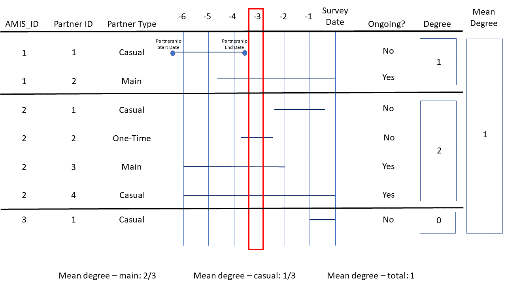

```{r setup, include=FALSE}
knitr::opts_chunk$set(echo = TRUE)
```

## Purpose

To compare two methods of determining the mean degree of ongoing casual and main partnerships using response data from the ART-net study.

## Description

Mean degree is an important measure of network connectivity which represents the average number of edges connected to a node/vertex. In this context, mean degree represents the average number of concurrent ongoing partners of an individual enrolled in the ART-net study.
The American Men's Internet Survey (AMIS), from which the ART-net study sources data, explicitly asks individuals about ongoing partnerships. Mean degree can be calculated through analysis of the responses to this question as a result. A similar question does not appear on the RADAR survey. As a result, alternate methods may be employed to estimate active and ongoing partnerships to derive the mean degree of individuals in the partnership network.
 
## Methods and Results

The ART-Net Survey asks study participants about the number of partners they have had in the past 12 months:

> In the past 12 months (since the same month last year), with how many different 
> men have you had either oral or anal sex?

The survey follows up with a question asking about the number of active, ongoing
sexual partnerships at the time of the survey among all partnerships that have occurred in the past 12 months:

> Next, think of all the men who you are in an active, ongoing sexual relationship 
> with. By that, we mean that you generally have oral or anal sex at least once per > month and you expect to continue doing so for some time. How many of your 
> partnerships in the past twelve months are active and ongoing?

As discussed in the description, mean degree can then be directly calculated from the responses to the above questions. 
I will refer to this as the **direct method**.

Below is the code to calculate mean degree by partnership type - casual or main - using the direct method from the ART-net long and wide datasets. Note that the granularity of the ART-net long dataset is the individual partnerships whereas the granularity of the ART-net wide dataset is the surveyed individual. First, the number of ongoing partnerships per individual is assessed using the long dataset. Then, mean degree is calculated by summing ongoing partnerships by surveyed individual and dividing by total surveyed individuals using the wide dataset.

```{r load, include=FALSE}
library(ARTnetData)
library(dplyr)
library(knitr)
library(kableExtra)
setwd("~/EpiModel Lab/Mean Degree Method Comparison")
```

```{r direct, warning=FALSE}
ARTnet.long$ONGOING <- as.numeric(ARTnet.long$ONGOING)
ARTnet.long$ongoing2 <- ifelse(is.na(ARTnet.long$ONGOING), 0, ARTnet.long$ONGOING)

ARTnet.wide <- ARTnet.long %>%
  filter(RAI == 1 | IAI == 1) %>%
  filter(ptype == 1) %>%
  group_by(AMIS_ID) %>%
  summarise(deg.main.direct = sum(ongoing2)) %>%
  right_join(ARTnet.wide, by = "AMIS_ID")

ARTnet.wide <- ARTnet.long %>%
  filter(RAI == 1 | IAI == 1) %>%
  filter(ptype == 2) %>%
  group_by(AMIS_ID) %>%
  summarise(deg.casl.direct = sum(ongoing2)) %>%
  right_join(ARTnet.wide, by = "AMIS_ID")

ARTnet.wide$deg.main.direct <- ifelse(is.na(ARTnet.wide$deg.main.direct), 0, ARTnet.wide$deg.main.direct)
ARTnet.wide$deg.casl.direct <- ifelse(is.na(ARTnet.wide$deg.casl.direct), 0, ARTnet.wide$deg.casl.direct)

mean.deg.main.direct <- mean(ARTnet.wide$deg.main.direct)
mean.deg.casl.direct <- mean(ARTnet.wide$deg.casl.direct)
```

```{r direct_results, echo=FALSE}
cat("Using the direct method, the mean degree of main partnerships among individuals in the ART-net\n dataset is: ", round(mean.deg.main.direct,4))

cat("Using the direct method, the mean degree of casual partnerships among individuals in the ART-net\n dataset is: ", round(mean.deg.casl.direct,4))
```

In contrast, an alternate approach referred to as the **three-month method**, for deriving active and ongoing partnerships may also be used in the instance where individuals are not explicitly asked about number of active and ongoing partners at the time of the survey. 

The three-month method starts by taking a three-month offset of the survey date. For example, if an individual was surveyed July 15th 2019, then their three-month offset would be April 15th 2019. Once this offset is established for all surveyed individuals, each individual partership is assessed to determine if the three-month offset falls between the start and end date of the partnership. If the three-month offset falls between the partership start and end date, then the partnership is considered "ongoing"; otherwise, it is not considered ongoing.



Similar code to the block above calculating mean degree using the direct method is used to calculate mean degree assessing ongoing partnerships using this three-month method.

```{r three_month, warning=FALSE}
prior.month.of.evaluation <- 12
ARTnet.long$ongoing.evaluation.date <- ARTnet.long$SUB_DATE - round(prior.month.of.evaluation*30.44)
ARTnet.long$ongoing3 <- ifelse(ARTnet.long$start.date <
                                 ARTnet.long$ongoing.evaluation.date &
                                 ARTnet.long$end.date >
                                 ARTnet.long$ongoing.evaluation.date, 1, 0)

ARTnet.wide <- ARTnet.long %>%
  filter(RAI == 1 | IAI == 1) %>%
  filter(ptype == 1) %>%
  group_by(AMIS_ID) %>%
  summarise(deg.main.three.month = sum(ongoing3)) %>%
  right_join(ARTnet.wide, by = "AMIS_ID")

ARTnet.wide <- ARTnet.long %>%
  filter(RAI == 1 | IAI == 1) %>%
  filter(ptype == 2) %>%
  group_by(AMIS_ID) %>%
  summarise(deg.casl.three.month = sum(ongoing3)) %>%
  right_join(ARTnet.wide, by = "AMIS_ID")

ARTnet.wide$deg.main.three.month <- ifelse(is.na(ARTnet.wide$deg.main.three.month), 0, ARTnet.wide$deg.main.three.month)
ARTnet.wide$deg.casl.three.month <- ifelse(is.na(ARTnet.wide$deg.casl.three.month), 0, ARTnet.wide$deg.casl.three.month)

mean.deg.main.three.month <- mean(ARTnet.wide$deg.main.three.month)
mean.deg.casl.three.month <- mean(ARTnet.wide$deg.casl.three.month)
```

```{r three_month_results, echo=FALSE}
cat("Using the three-month method, the mean degree of main partnerships among individuals in the ART-net\n dataset is: ", round(mean.deg.main.three.month,4))

cat("Using the three-month method, the mean degree of casual partnerships among individuals in the ART-net\n dataset is: ", round(mean.deg.casl.three.month,4))
```

Here are the results comparing mean degree by partnership type (main or casual) and method of determining ongoing partnerships (direct or three-month) in table form:

```{r comparison, warning=FALSE, include=FALSE}

Partnership.Type <- rbind(c("Main"),c("Casual"))

mean.degree.main <- ARTnet.wide %>%
  summarize(mean.deg.main.direct = round(mean(ARTnet.wide$deg.main.direct),4),
            mean.deg.main.three.month = round(mean(ARTnet.wide$deg.main.three.month),4))
colnames(mean.degree.main) <- c("Direct", "Three.Month")

mean.degree.casl <- ARTnet.wide %>%
  summarize(mean.deg.casl.direct = round(mean(ARTnet.wide$deg.casl.direct),4),
            mean.deg.casl.three.month = round(mean(ARTnet.wide$deg.casl.three.month),4))
colnames(mean.degree.casl) <- c("Direct", "Three.Month")

mean.degree.df <- data.frame(matrix(ncol = 2, nrow = 0))
colnames(mean.degree.df) <- c("Direct", "Three.Month")

mean.degree.df <- rbind(mean.degree.df, mean.degree.main, mean.degree.casl)

mean.degree.df

```

```{r comparison_final, warning=FALSE, echo=FALSE}
mean.degree.df.final <- data.frame(matrix(ncol = 3, nrow = 0))
colnames(mean.degree.df.final) <- c("Type","Direct","Three.Month")

mean.degree.df.final <- cbind(Partnership.Type, mean.degree.df)

mean.degree.df.final

```

The mean degree by partnership type calculated using the direct and three-month methods are similar.

Next, instead of assessing ongoing partnerships using a three-month offset, we can generalize our approach to look at n-month offsets for user specified values of n.

For the purpose of this example, we assessed ongoing partnerships with one- to twelve- month offsets and reviewed how mean degree would change depending on months of offset.

The pairs of plots below show how mean degree changes depending on number of months of offset used for determination of whether or not a partnership is ongoing. The plots show the same data, with the second pair of plots showing the results at larger scale.

The data may also be viewed in the table directly below the pair of plots.

```{r generalized_month_offset, include=FALSE}
##N-Month Method

# Specify start and end months for offsets
# Note: Only single month steps are supported
start_month_offset <- 1
end_month_offset <- 12

month <- seq(start_month_offset, end_month_offset)
n_month <- paste(month, "M", sep="")

# Initalize data frames with appropriate row and column dimensions
ongoing.eval.m <- matrix(nrow = length(ARTnet.long$SUB_DATE), ncol = end_month_offset - start_month_offset + 1)
ongoing.eval.df <- data.frame(ongoing.eval.m)

ongoing3.m <- matrix(nrow = length(ARTnet.long$SUB_DATE), ncol = end_month_offset - start_month_offset + 1)
ongoing3.df <- data.frame(ongoing3.m)

ARTnet.long.adjusted <- ARTnet.long
ARTnet.wide.adjusted <- ARTnet.wide

mean.degree.main <- c()
mean.degree.casual <- c()

for (i in start_month_offset:end_month_offset) {

  ongoing.eval <- paste("ongoing.evaluation.date.m",i,sep="")
  names(ongoing.eval.df)[i - start_month_offset + 1] <- ongoing.eval
  assign(ongoing.eval, ARTnet.long$SUB_DATE - round(i*30.44))
  ongoing.eval.df[,i - start_month_offset + 1] <- get(ongoing.eval)

  ongoing3 <- paste("ongoing3.m",i,sep="")
  names(ongoing3.df)[i - start_month_offset + 1] <- ongoing3
  assign(ongoing3, ifelse(ARTnet.long.adjusted$start.date < get(ongoing.eval) &
                            ARTnet.long.adjusted$end.date > get(ongoing.eval),
                          1, 0))
  ongoing3.df[,i - start_month_offset + 1] <- get(ongoing3)

  ARTnet.long.adjusted <- cbind(ARTnet.long.adjusted,
                                ongoing.eval.df[i - start_month_offset + 1],
                                ongoing3.df[i - start_month_offset + 1])

  ARTnet.wide.adjusted <- ARTnet.long.adjusted %>%
    filter(RAI == 1 | IAI == 1) %>%
    filter(ptype == 1) %>%
    group_by(AMIS_ID) %>%
    summarise(deg.main.n.month = sum(get(paste("ongoing3.m",i,sep="")))) %>%
    right_join(ARTnet.wide.adjusted, by = "AMIS_ID")

  ARTnet.wide.adjusted$deg.main.n.month <- ifelse(is.na(ARTnet.wide.adjusted$deg.main.n.month), 0, ARTnet.wide.adjusted$deg.main.n.month)
  mean.degree.main[i - start_month_offset + 1] <- mean(ARTnet.wide.adjusted$deg.main.n.month)
  deg.main.n.month.name <- paste("deg.main.n.month.m",i,sep="")
  names(ARTnet.wide.adjusted)[names(ARTnet.wide.adjusted) == "deg.main.n.month"] <- deg.main.n.month.name

  ARTnet.wide.adjusted <- ARTnet.long.adjusted %>%
    filter(RAI == 1 | IAI == 1) %>%
    filter(ptype == 2) %>%
    group_by(AMIS_ID) %>%
    summarise(deg.casl.n.month = sum(get(paste("ongoing3.m",i,sep="")))) %>%
    right_join(ARTnet.wide.adjusted, by = "AMIS_ID")

  ARTnet.wide.adjusted$deg.casl.n.month <- ifelse(is.na(ARTnet.wide.adjusted$deg.casl.n.month), 0, ARTnet.wide.adjusted$deg.casl.n.month)
  mean.degree.casual[i - start_month_offset + 1] <- mean(ARTnet.wide.adjusted$deg.casl.n.month)
  deg.casl.n.month.name <- paste("deg.casl.n.month.m",i,sep="")
  names(ARTnet.wide.adjusted)[names(ARTnet.wide.adjusted) == "deg.casl.n.month"] <- deg.casl.n.month.name

}
```

```{r plots_tables, fig.align='center', echo=FALSE}
# RESULTS

par(mfrow=c(1,2))

plot(month, mean.degree.main, main = "Mean Degree of Main Partnerships \nN-Month Method - Points, Direct Method - Line",
     xlab = "Number of Offset Months of Survey Date \nN-Month Method",
     ylab = "Mean Degree - Main Partnerships",
     ylim = c(0,1),
     cex.main = 0.8)
abline(h=mean.deg.main.direct, col="blue")
text(0.6*(end_month_offset - start_month_offset),
     1.15*mean.deg.main.direct,
     paste("Mean Degree - Direct Method = ",round(mean.deg.main.direct,4),sep=""),
     cex = .75)

plot(month, mean.degree.casual, main = "Mean Degree of Casual Partnerships \nN-Month Method - Points, Direct Method - Line",
     xlab = "Number of Offset Months of Survey Date \nN-Month Method",
     ylab = "Mean Degree - Casual Partnerships",
     ylim = c(0,1),
     cex.main = 0.8)
lines(mean.deg.casl.direct)
abline(h=mean.deg.casl.direct, col="purple")
text(0.6*(end_month_offset - start_month_offset),
     1.15*mean.deg.casl.direct,
     paste("Mean Degree - Direct Method = ",round(mean.deg.casl.direct,4),sep=""),
     cex = .75)

plot(month, mean.degree.main, main = "Mean Degree of Main Partnerships \nN-Month Method - Points, Direct Method - Line",
     xlab = "Number of Offset Months of Survey Date \nN-Month Method",
     ylab = "Mean Degree - Main Partnerships",
     cex.main = 0.8)
abline(h=mean.deg.main.direct, col="blue")
text(0.6*(end_month_offset - start_month_offset),
     0.99*mean.deg.main.direct,
     paste("Mean Degree - Direct Method = ",round(mean.deg.main.direct,4),sep=""),
     cex = .75)

plot(month, mean.degree.casual, main = "Mean Degree of Casual Partnerships \nN-Month Method - Points, Direct Method - Line",
     xlab = "Number of Offset Months of Survey Date \nN-Month Method",
     ylab = "Mean Degree - Casual Partnerships",
     cex.main = 0.8)
lines(mean.deg.casl.direct)
abline(h=mean.deg.casl.direct, col="purple")
text(0.6*(end_month_offset - start_month_offset),
     1.01*mean.deg.casl.direct,
     paste("Mean Degree - Direct Method = ",round(mean.deg.casl.direct,4),sep=""),
     cex = .75)

#Mean degree - main
mean.degree.main.df <- data.frame(n_month, round(mean.degree.main,4))

#Mean degree - casual
mean.degree.casual.df <- data.frame(n_month, round(mean.degree.casual,4))

mean.degree.table <- mean.degree.main.df %>%
  left_join(mean.degree.casual.df, by = "n_month")
colnames(mean.degree.table) <- c("Month", "Main", "Casual")

mean.degree.table <- setNames(data.frame(t(mean.degree.table[,-1])), mean.degree.table[,1])

direct_ref_col <- rbind(c(round(mean.deg.main.direct,4)),c(round(mean.deg.casl.direct,4)))
colnames(direct_ref_col) <- c("Direct")

mean.degree.table <- cbind(mean.degree.table, direct_ref_col)

kable(mean.degree.table) %>%
  kable_styling(bootstrap_options = "striped", font_size = 12)


```
